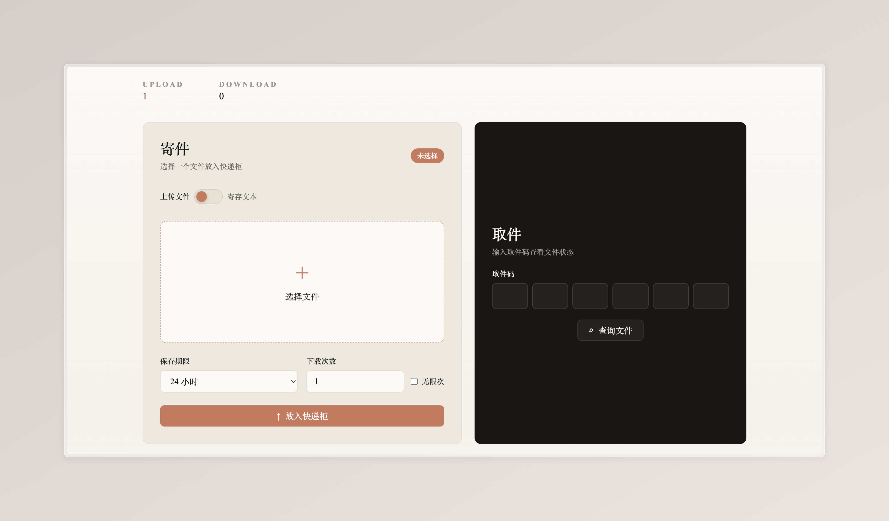

一个基于 Cloudflare Workers、R2 和 D1 的文件快递柜, 支持取件码领取、下载次数限制、自动过期和后台管理.

> 拥抱 serverless, 拒绝繁重的部署方式.

[部署文档](./docs/deploy.md) | [开发文档](./docs/development.md) | [在线示例](https://fdlw-demo.meorion.moe/)

## 功能

- 支持寄存单个文件, 最大 100 MB.
- 支持寄存文本, 最大 256 KB, 并可在取件页直接预览和复制.
- 保存期限可选 1 小时、24 小时、 7 天或者无期限.
- 最大下载/查看次数可设置为 1 到 10 次或者无限.
- 上传时计算内容哈希, 相同文件或文本会复用已有 R2 对象并生成新的取件码.
- 取件码使用 Secret Pepper 做 HMAC-SHA-256 哈希, 管理码只保存 SHA-256 哈希, 不以明文入库.
- 取件查询使用 Cap.js Proof-of-Work 防枚举, 且挑战难度会随错误次数递增.
- 文件到期、下载次数用尽或主动撤回后, 会标记记录并删除 R2 对象.
- 上传和下载使用流式处理, 减少 Worker 内存压力.
- 可配置站点访问密码、管理后台密码和只读演示模式.
- 提供 `/admin` 管理后台, 可查看投递记录、上传/下载来源事件, 手动撤回或调整下载次数.
- 提供站点统计接口和首页上传/下载计数展示.
- 支持游客模式, 游客模式不需要密码, 可以一键下载文件

---

A lightweight temporary file/text delivery locker built on Cloudflare Workers, R2, and D1. It supports pickup-code retrieval, download/view limits, automatic expiration, and an admin console.

> Serverless-friendly, without a heavy deployment footprint.

[Development documentation](./docs/deploy.md) | [Deployment documentation](./docs/development.md) | [Demo](https://fdlw-demo.meorion.moe/)

## Features

- Store a single file up to 100 MB.
- Store text up to 256 KB, with direct preview and copy support on the pickup page.
- Choose a retention period of 1 hour, 24 hours, 7 days or unlimited.
- Configure a maximum download/view count from 1 to 10 or unlimited.
- Compute a content hash on upload, so identical files or text reuse the existing R2 object while still receiving a new pickup code.
- Hash pickup codes with HMAC-SHA-256 using a secret pepper; store manage codes only as SHA-256 hashes, never in plaintext.
- Protect pickup lookups from enumeration with Cap.js Proof-of-Work, with challenge difficulty increasing after repeated failures.
- Mark records and delete R2 objects when deliveries expire, reach their download limit, or are manually revoked.
- Stream uploads and downloads to reduce Worker memory pressure.
- Configure a site access password, admin password, and read-only demo mode.
- Provide an `/admin` console for viewing delivery records, upload/download source events, manual revocation, and download-count adjustments.
- Provide a site stats API and homepage upload/download counters.
- Supports guest mode. In guest mode, no password is required and files can be downloaded with one click

