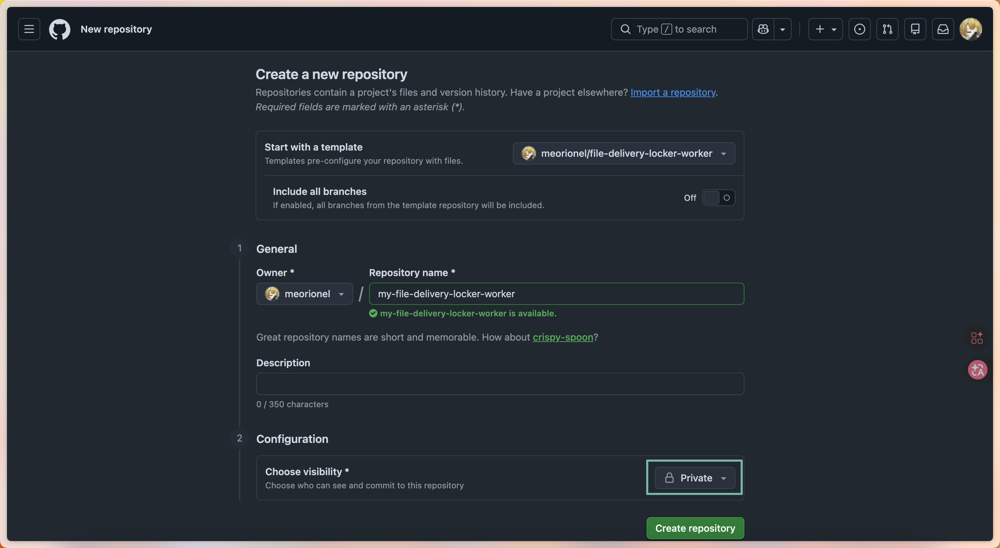
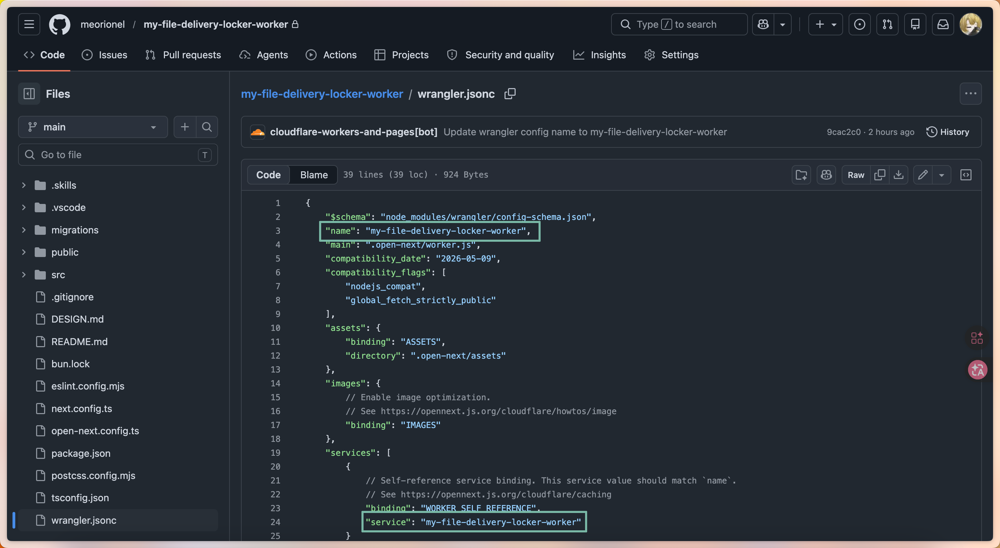
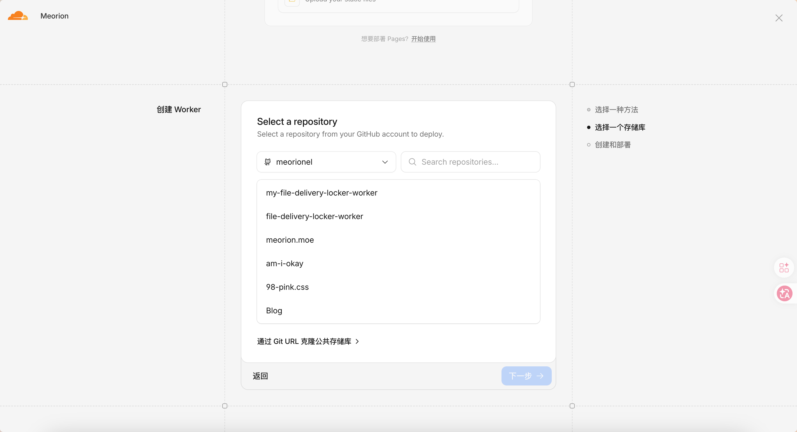
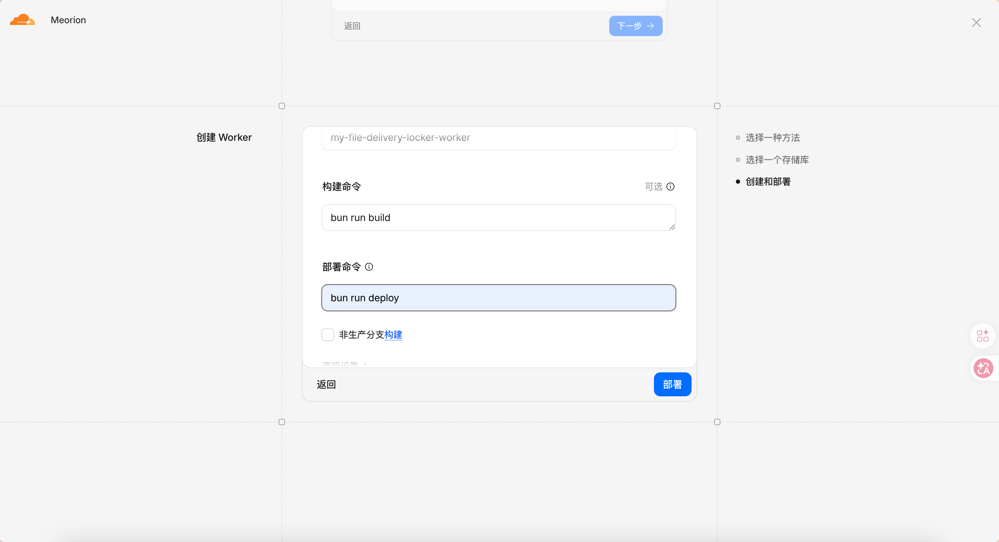
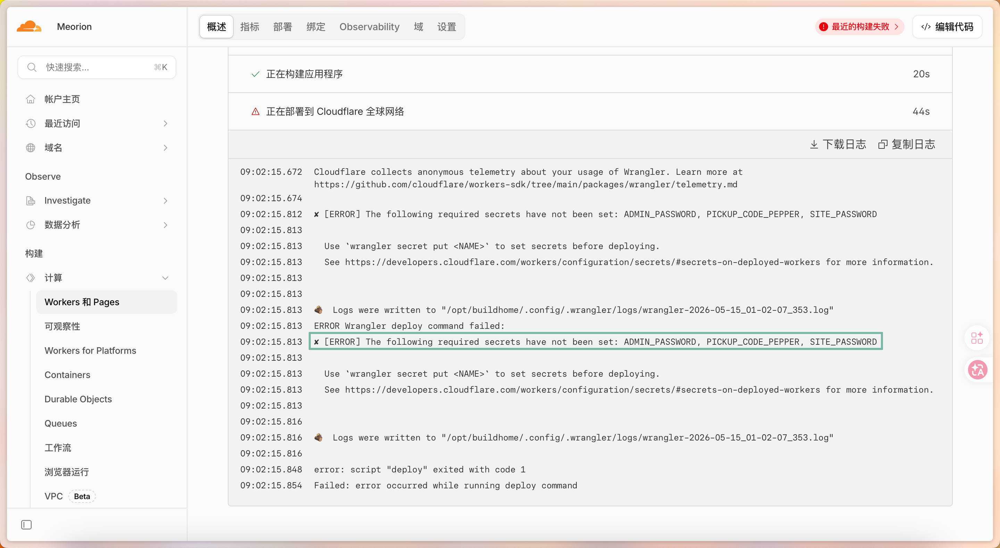
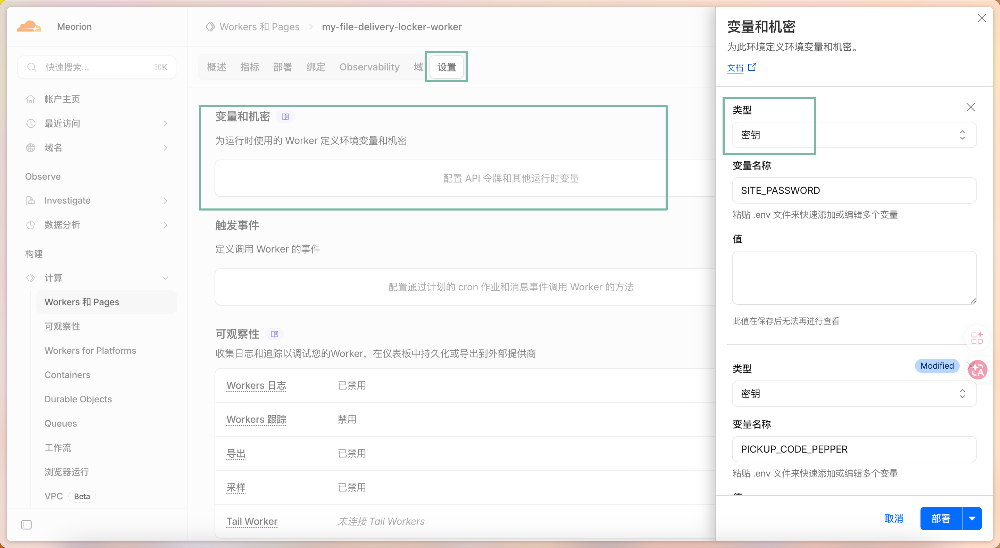
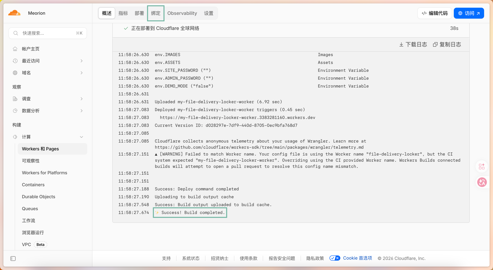

# 快速部署

首先你需要点击库页面右上角的 "Use this template", 创建一个库

> 如果你希望能接收到之后的更新也可以选择 fork, 只是 "Use this template" 可以将库设置为私密



打开 `./wrangler.jsonc` 文件, 修改 `name`, `services.service` 的值为你库的名字



切换到 CloudFlare 在侧边栏 -> 计算 -> workers 和 Pages 下创建一个应用程序

选择 Continue with GitHub, 如果你没有绑定你的 GitHub 可能需要先绑定一下



选择你一开始创建的库, 然后修改部署命令为 `bun run deploy`



然后点击部署, 坐和放宽...

然后你大概率会看到这个报错



这是因为 secret 这个东西没法在部署的准备阶段设置

> 天杀的, 你既然不能设置就不要报错啊, 你这混蛋

我们只需要点击上面的设置, 然后添加一下 `ADMIN_PASSWORD` `PICKUP_CODE_PEPPER` `SITE_PASSWORD`

主要! 添加时需要修改类型为密钥

这仨分别是:

- ADMIN_PASSWORD      后台管理员密码
- SITE_PASSWORD       用户访问网站用的密码
- PICKUP_CODE_PEPPER  生成取件码时的pepper, 你不需要知道这是什么, 你只需要把你的脸放到键盘上然后滚动, 滚出一堆随机长字符串



添加完成点击部署

默认会使用 Cloudflare R2。若要改用 S3 兼容 API，请在 Worker 环境变量中设置：

- `STORAGE_BACKEND=s3`
- `S3_ENDPOINT`
- `S3_BUCKET`
- `S3_REGION`（Cloudflare R2 S3 API 可用 `auto`，AWS S3 请填真实 region）
- `S3_FORCE_PATH_STYLE`（默认 `true`）

并将 `S3_ACCESS_KEY_ID`、`S3_SECRET_ACCESS_KEY` 作为密钥添加。使用 S3 后端时，部署准备脚本会跳过 R2 bucket 创建。

部署完成后，也可以在 `/admin` 的“运行设置”中切换 R2 / S3 兼容 API、修改 S3 配置、开关“允许自定义取件码”，以及配置对象缓存秒数。后台保存的 S3 Secret 会加密写入 D1；建议额外添加 `STORAGE_CONFIG_KEY` Secret，未添加时会回退使用 `PICKUP_CODE_PEPPER` 派生加密密钥。

然后切换到 R2 和 D1 的页面, 将上次自动创建的数据库和对象存储删了

回到 workers 页面, 点击`最近的部署失败`, 再点击重试构建, 坐和放宽...

等待 `✨ Success! Build completed.` 之后就可以点击访问! 你就可以开始使用了



> 不要在意截图里面的错误

如果你有自己的域名可以绑定到自己的域名上

---

# Quick Deployment

First, click **Use this template** in the top-right corner of the repository page to create your own repository.

> If you want to receive future updates, you can also fork the repository. The benefit of **Use this template** is that it lets you make the new repository private.


Open `./wrangler.jsonc`, then change `name` and `services.service` to match your repository name.


Go to Cloudflare, then use the sidebar to open **Compute** -> **Workers & Pages**, and create an application.

Choose **Continue with GitHub**. If your GitHub account is not connected yet, Cloudflare may ask you to connect it first.


Select the repository you created earlier, then change the deploy command to:

```bash
bun run deploy
```


Click deploy, then sit back for a moment.

You will probably see this error:


This happens because secrets cannot be configured during the deployment preparation stage.

Open the settings shown above, then add these secrets:

- `ADMIN_PASSWORD`
- `PICKUP_CODE_PEPPER`
- `SITE_PASSWORD`

Important: when adding them, set their type to **Secret**.

These values mean:

- `ADMIN_PASSWORD`: the admin console password.
- `SITE_PASSWORD`: the password users need to access the site.
- `PICKUP_CODE_PEPPER`: the pepper used when generating pickup-code hashes. You do not need to understand the internals; use a long, random string.


After adding the secrets, click deploy.

Cloudflare R2 is used by default. To use an S3-compatible API instead, set these Worker variables:

- `STORAGE_BACKEND=s3`
- `S3_ENDPOINT`
- `S3_BUCKET`
- `S3_REGION` (`auto` works for Cloudflare R2 S3 API; use the real region for AWS S3)
- `S3_FORCE_PATH_STYLE` (defaults to `true`)

Then add `S3_ACCESS_KEY_ID` and `S3_SECRET_ACCESS_KEY` as secrets. With the S3 backend enabled, the deploy preparation script skips R2 bucket creation.

After deployment, `/admin` **Runtime Settings** can also switch between R2 and S3-compatible storage, update S3 configuration, toggle custom pickup codes, and configure object cache TTL. S3 secrets saved from the admin page are encrypted in D1. Add `STORAGE_CONFIG_KEY` as an extra secret when possible; if omitted, `PICKUP_CODE_PEPPER` is used as the fallback encryption key.

Then go to the R2 and D1 pages, and delete the database and object storage bucket that were created during the failed deployment attempt.

Return to the Workers page, click the most recent failed deployment, then click **Retry build**. Sit back again.

When you see `✨ Success! Build completed.`, you can open the deployed site and start using it.


> Ignore the error shown in the screenshot.

If you own a custom domain, you can bind the Worker to that domain.
