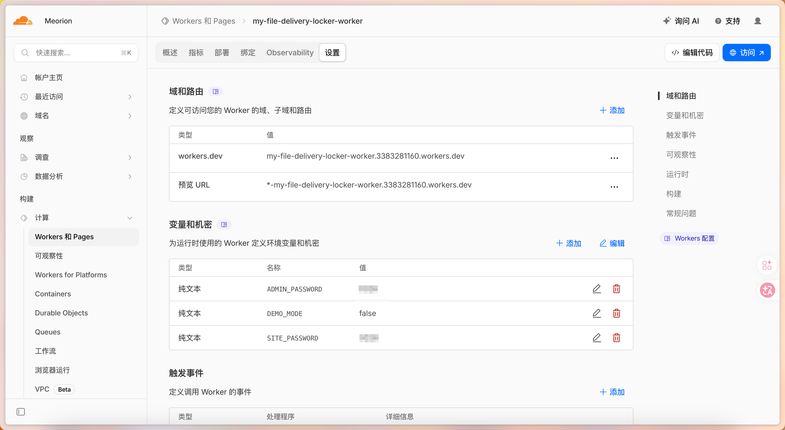

# 快速部署

首先你需要点击库页面右上角的 "Use this template", 创建一个私密的库

打开 `./wrangler.jsonc` 文件, 修改 `name`, `services.service` 的值为你库的名字

在侧边栏 -> 计算 -> workers 和 Pages 下创建一个应用程序

选择 Continue with GitHub, 如果你没有绑定你的 GitHub 可能需要先绑定一下

选择你一开始创建的库, 然后修改部署命令为 `bun run deploy`

然后点击部署, 坐和放宽...

等待 `✨ Success! Build completed.` 之后, 点击上方的设置

> 不要在意截图里面的错误

然后添加环境变量:

- `SITE_PASSWORD`: 站点密码-字符串类型: 选填, 如果此环境变量存在, 进入网站时会要求输入密码
- `ADMIN_PASSWORD`*: 后台密码-字符串类型: 必填, 如果此环境变量不存在无法进入管理后台 `/admin`
- `DEMO_MODE`: 演示模式-布尔类型: 默认 false, 开启此模式网站所有页面都可以进入, 但是无法进行任何上传下载等操作

如果你有自己的域名可以绑定到自己的域名上

然后点击访问! 你就可以开始使用了
